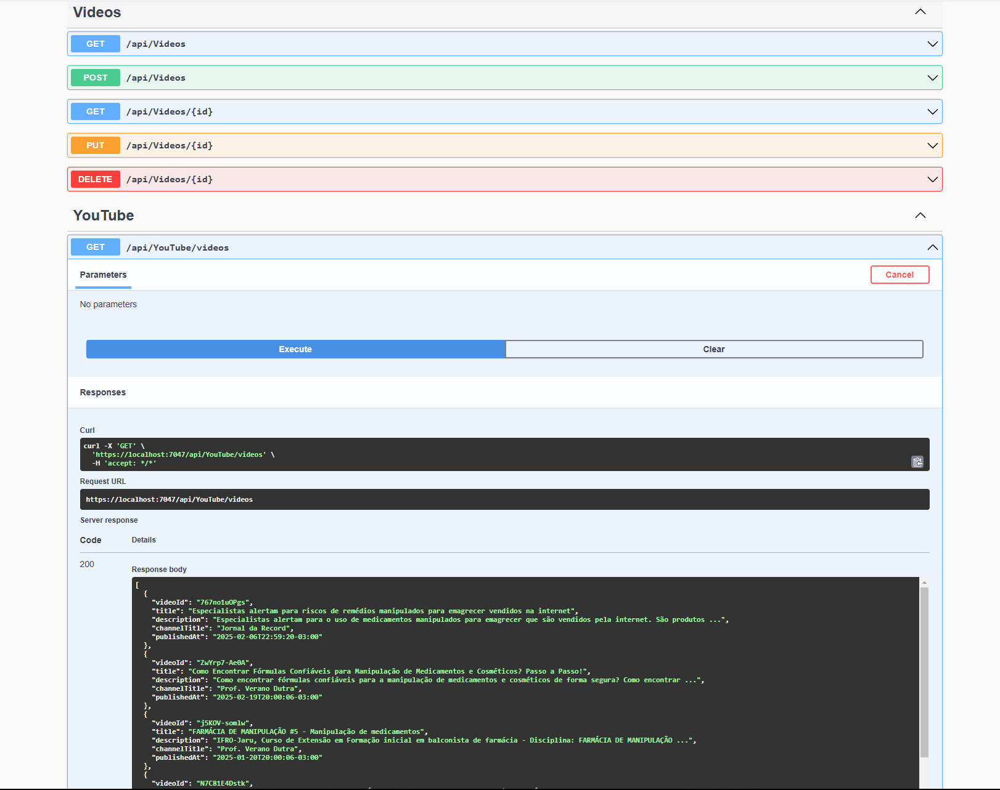

# RDManipulacao

RDManipulacao é uma API construída em .NET 8.0 que integra dados da YouTube Data API v3 para gerenciar vídeos relacionados à manipulação de medicamentos. Os vídeos são filtrados para exibir conteúdos brasileiros publicados no ano de 2025. A aplicação utiliza um banco de dados SQLite para persistência dos dados e está organizada em uma arquitetura em camadas, facilitando a manutenção e evolução do sistema.

## Recursos
- **Integração com a YouTube Data API v3:** Consulta vídeos brasileiros relacionados à manipulação de medicamentos publicados em 2025.
- **Operações CRUD:** Criação, leitura (com paginação), atualização e exclusão lógica de vídeos.
- **Arquitetura em Camadas:**  
  - **Domain:** Contém as entidades e regras de negócio (ex.: `Video`).
  - **Application:** Lógica de aplicação, serviços (ex.: `VideoService` e `YouTubeService`) e interfaces.
  - **Infrastructure:** Acesso a dados, repositórios e configuração do EF Core para SQLite.
  - **API:** Endpoints REST, configuração de middlewares, Swagger e gerenciamento de requisições.
- **Banco de Dados SQLite:** Persistência simples e leve dos dados.
- **Logs e Tratamento de Erros:** Registro detalhado de operações e tratamento de exceções para facilitar a manutenção.

## Estrutura do Projeto



```
RDManipulacao.sln
│
├── RDManipulacao.Api
│   ├── Controllers
│   │   ├── VideosController.cs
│   │   └── YouTubeController.cs
│   ├── Program.cs
│   ├── appsettings.json
│   └── RDManipulacao.Api.csproj
│
├── RDManipulacao.Application
│   ├── Interfaces
│   │   ├── IVideoService.cs
│   │   └── IYouTubeService.cs
│   ├── Services
│   │   ├── VideoService.cs
│   │   └── YouTubeService.cs
│   └── RDManipulacao.Application.csproj
│
├── RDManipulacao.Domain
│   ├── Entities
│   │   ├── VideoBase.cs
│   │   └── Video.cs
│   ├── Models
│   │   └── YouTubeVideo.cs
│   └── RDManipulacao.Domain.csproj
│
└── RDManipulacao.Infrastructure
    ├── Data
    │   └── AppDbContext.cs
    ├── Repositories
    │   ├── IVideoRepository.cs
    │   └── VideoRepository.cs
    └── RDManipulacao.Infrastructure.csproj
```

## Requisitos
- [.NET 8.0 SDK](https://dotnet.microsoft.com/download/dotnet/8.0)
- [SQLite](https://www.sqlite.org/index.html)
- Uma chave da YouTube Data API v3. **Importante:** A chave não deve estar hardcoded no código. Utilize a variável de ambiente `YOUTUBE_API_KEY`.

## Instalação e Execução

### Clonando o Repositório
```bash
git clone https://github.com/pedro381/rd-manipulacao-api.git
cd rd-manipulacao-api
```

### Restaurando e Construindo a Solução
```bash
dotnet restore
dotnet build
```

### Executando a API
1. Navegue até o diretório da API:
   ```bash
   cd src/RDManipulacao.Api
   ```
2. Execute a aplicação:
   ```bash
   dotnet run
   ```
3. A API estará disponível em `https://localhost:5088` (ou na porta configurada). Você pode acessar a interface do Swagger em `http://localhost:5088/swagger` para testar os endpoints.

## Configuração

### Variáveis de Ambiente
Configure a variável `YOUTUBE_API_KEY` com sua chave da API:
```bash
export YOUTUBE_API_KEY=your_api_key_here
```
*No Windows, utilize:*
```powershell
$env:YOUTUBE_API_KEY="your_api_key_here"
```

### Configuração do Banco de Dados
A string de conexão para o SQLite está definida no arquivo `appsettings.json`:
```json
{
  "ConnectionStrings": {
    "DefaultConnection": "Data Source=RDManipulacao.db"
  },
  "Logging": {
    "LogLevel": {
      "Default": "Information",
      "Microsoft": "Warning",
      "Microsoft.Hosting.Lifetime": "Information"
    }
  },
  "AllowedHosts": "*"
}
```

## Endpoints da API

### Operações de Vídeos
- **GET `/api/videos?pageNumber={pageNumber}&pageSize={pageSize}`**  
  Retorna uma lista paginada de vídeos cadastrados.
- **GET `/api/videos/{id}`**  
  Retorna os detalhes de um vídeo específico.
- **POST `/api/videos`**  
  Cria um novo registro de vídeo.
- **PUT `/api/videos/{id}`**  
  Atualiza um registro existente.
- **DELETE `/api/videos/{id}`**  
  Realiza a exclusão lógica (marca o registro como excluído).

### Integração com a YouTube Data API
- **GET `/api/YouTube/videos`**  
  Consulta a YouTube Data API v3 e retorna vídeos relacionados à manipulação de medicamentos, filtrados por vídeos brasileiros e publicados em 2025.

## Logs e Tratamento de Erros
- A aplicação utiliza o `Microsoft.Extensions.Logging` para registrar informações, avisos e erros.
- Cada operação crítica possui blocos `try-catch` para capturar e registrar exceções, garantindo robustez e facilitando a depuração.
- Em caso de erros internos, a API retorna um status HTTP 500, evitando a exposição de detalhes sensíveis.

## Contribuição
Contribuições são bem-vindas! Sinta-se à vontade para abrir issues ou enviar pull requests com melhorias e correções. Ao contribuir, siga as melhores práticas de codificação e mantenha a consistência com a arquitetura do projeto.

## Licença
Este projeto está licenciado sob a [MIT License](LICENSE).